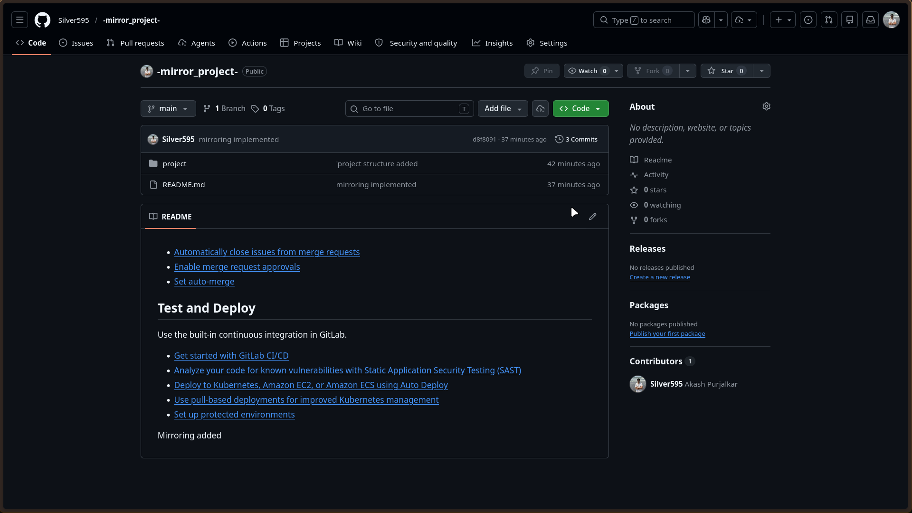
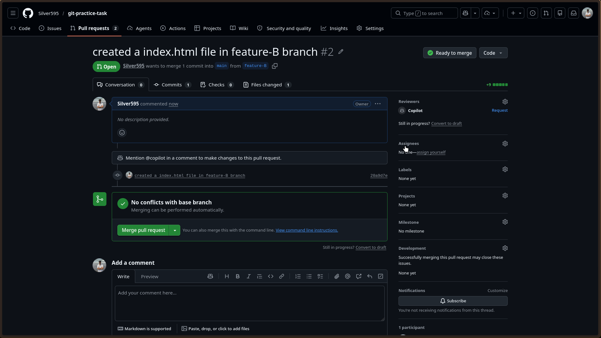
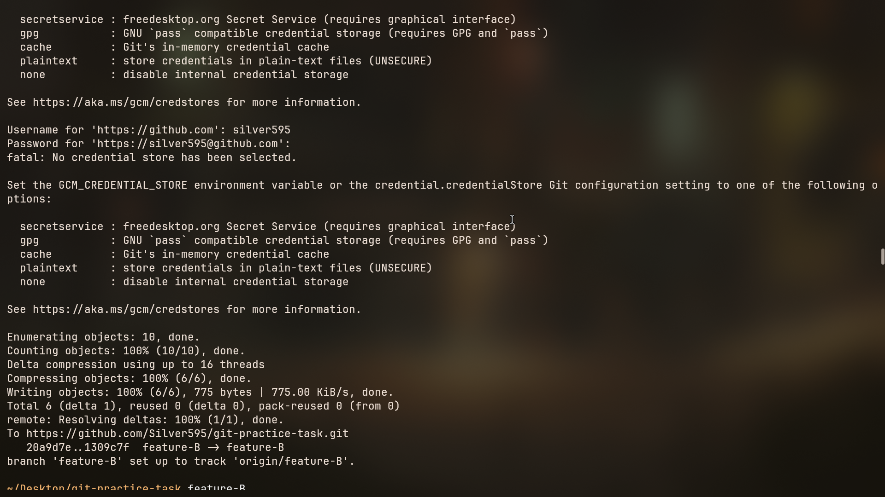
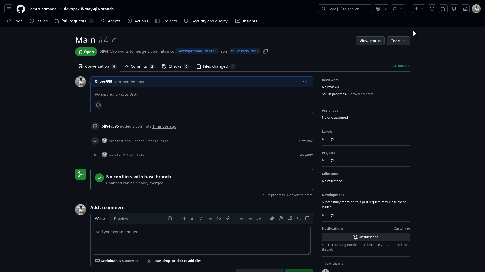
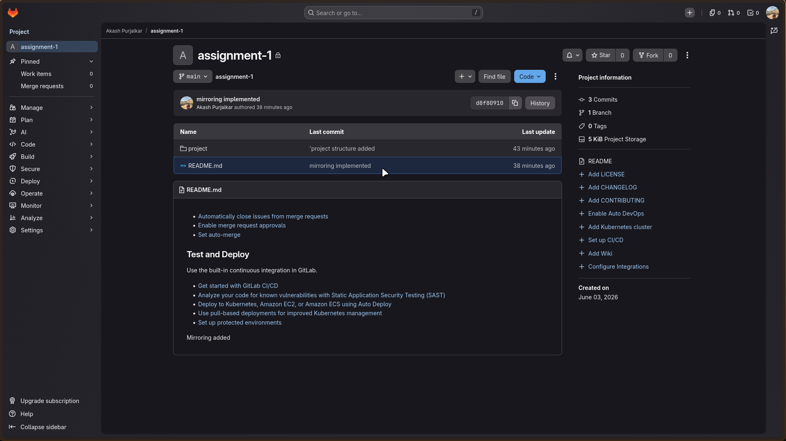
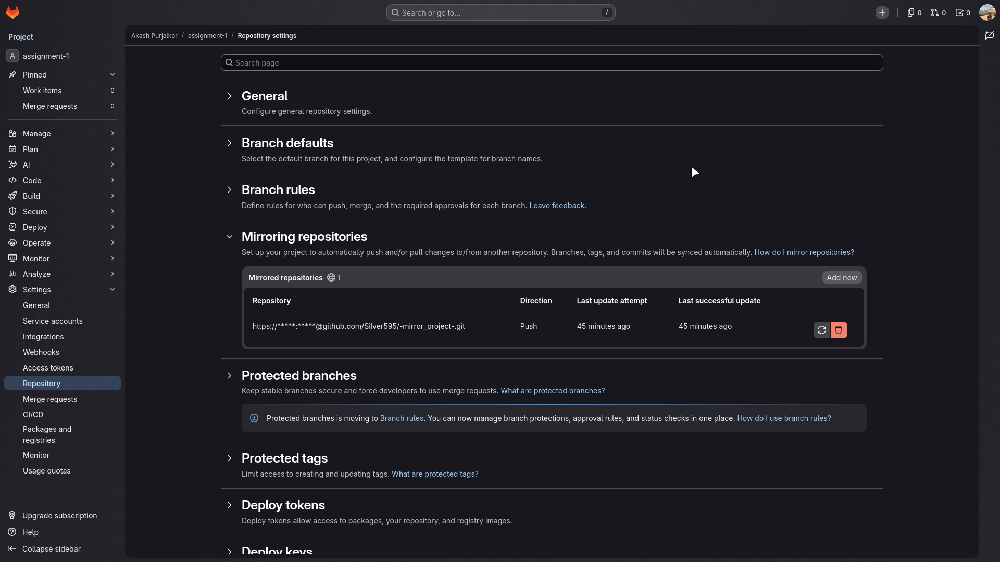
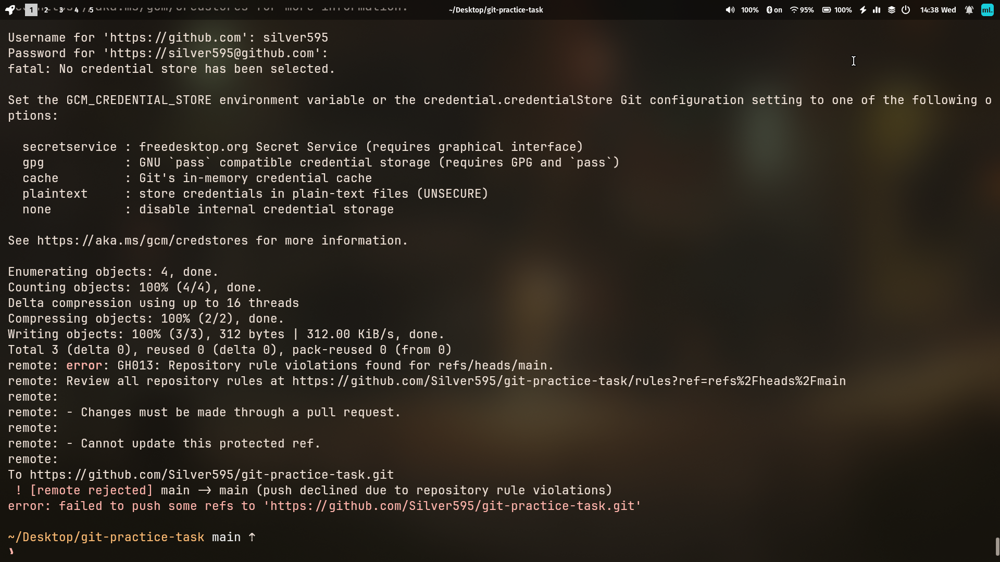

# Git & GitLab Practical Assignment

## Student Information

**Name:** Akash Purjalkar  
**Batch:** 18th May  
**Course:** DevOps

---

## Task 1: GitHub Repository

Created a public GitHub repository named **git-practice-task** with a README file.

### Screenshot

---

## Task 2: Clone Repository

Cloned the repository to the local machine and verified the setup.

---

## Task 3: Update README

Added assignment details to the README file and pushed the changes to GitHub.

---

## Task 4: Feature-A Branch

Created **feature-A**, added `index.html`, committed, and pushed the branch.

---

## Task 5: Pull Request

Created a Pull Request from **feature-A** to **main**.

### Screenshot

---

## Task 6: Feature-B Branch

Created **feature-B**, modified `index.html`, committed, pushed, and created a Pull Request.

### Screenshot

---

## Task 7: Merge Feature-A

Reviewed and merged the **feature-A** Pull Request into **main**.

---

## Task 8: Merge Conflict Resolution

Resolved the merge conflict manually, committed the changes, and pushed the updated branch.

### Screenshot

---

## Task 9: Merge Feature-B

Merged the **feature-B** Pull Request after resolving the conflict.

---

## Task 10: Fork and Contribute

Forked a public repository, updated the README, pushed the changes, and created a Pull Request.

### Screenshot

---

## Task 11: GitLab Repository Setup

Created a private GitLab repository and added the required project structure.

### Screenshot

---

## Task 12: Repository Mirroring

Configured repository mirroring between GitLab and GitHub and verified synchronization.

### Screenshot

---

## Task 13: Branch Protection

Enabled branch protection on the **main** branch and restricted direct pushes.

### Screenshot

---

## Task 14: Final Verification

Successfully completed the following:

- GitHub repository creation
- Repository cloning
- Feature branch creation
- Pull Request creation
- Pull Request merging
- Merge conflict resolution
- Fork and contribution workflow
- GitLab repository setup
- Repository mirroring
- Branch protection configuration

---

# Repository URLs

## GitHub Repository

https://github.com/Silver595/git-practice-task

## GitLab Repository

https://gitlab.com/Silver595/assignment-1.git

---

## Conclusion

This assignment demonstrated practical usage of Git and GitLab for repository management, branching strategies, pull requests, merge conflict resolution, repository mirroring, and branch protection.
